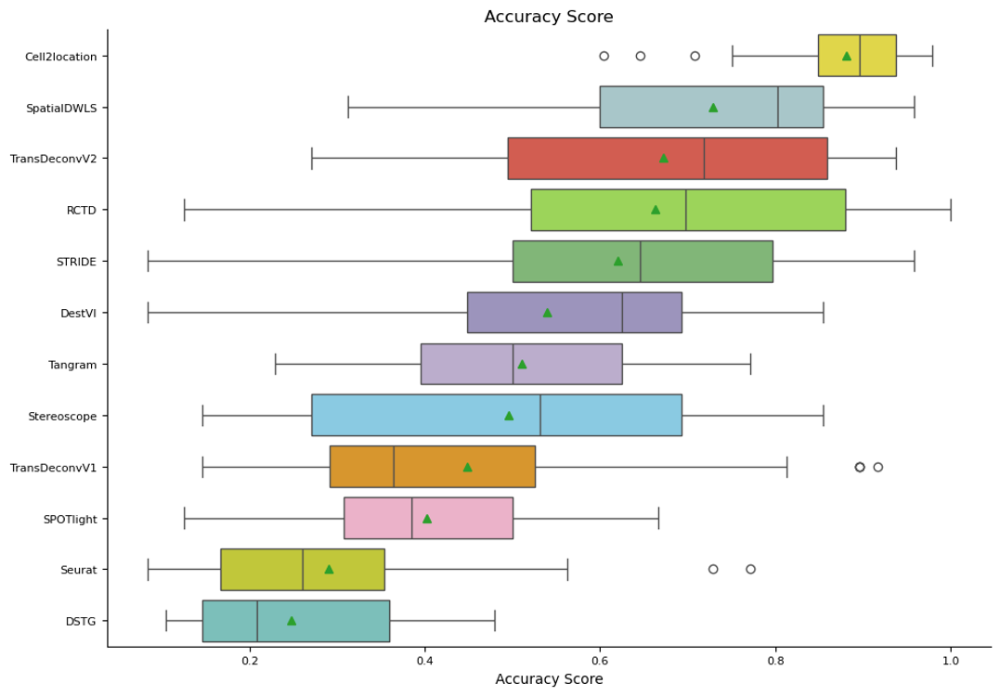
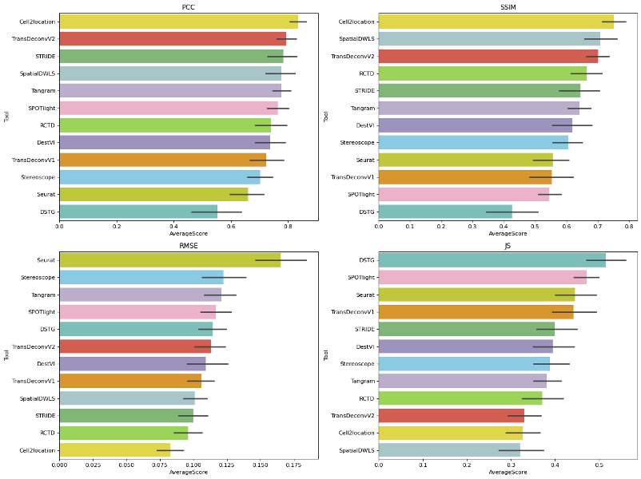

[![PyPi][badge-pypi]][link-pypi]
[![DOC][badge-doc]][link-doc]
[![CI][badge-ci]][link-ci]

[badge-pypi]: https://badge.fury.io/py/transpa.svg
[link-pypi]: https://pypi.org/project/transpa/
[badge-doc]: https://readthedocs.org/projects/transpa/badge/?version=latest
[link-doc]: https://transpa.readthedocs.io/en/latest/
[badge-ci]: https://api.travis-ci.com/qiaochen/tranSpa.svg?branch=main
[link-ci]: https://app.travis-ci.com/github/qiaochen/tranSpa

# Updates on **V0.2.0** :
1. `expDeconv`, improved performance with marker gene selection, loss updates, while keeping lite-weighted and fast, achieving improved performance with default setting on the 32 benchmark datasets by [Li et al.](https://www.nature.com/articles/s41592-022-01480-9).

 

2. `expVeloImp`, post-processing for imputed Spliced and Unspliced count matrices, the issue reported in Fig. 6 of [VISTA paper](https://www.nature.com/articles/s42003-025-09479-6#Fig6) is now fixed with updated experiment result in notebook [transDeconv.ipynb](https://github.com/qiaochen/tranSpa/blob/main/demo/transDeconv.ipynb). The fix was to sparsify small non-zero values (at 1e-6 magnitude) to zero, since `scv.tl.proportions` cacluate non-zero gene counts to compute proportions, and recalibrate the proportion of spliced/unspliced imputations towards reference distributions.  
3. `expTransImp`, added batch training options to metigate OOM issues raised in [VISTA paper](https://www.nature.com/articles/s42003-025-09479-6#Fig6).

# TranSpa
This tool implements Translation-based imputation methods (TransImp) and translation based cell type deconvolution (TransDeconv). Experiments reported in the manuscript are displayed in jupyter notebooks under repo [TranSpaAnalysis](https://github.com/qiaochen/TranSpaAnalysis/tree/main). Report for `TransImp` can be accessed from biorxiv with the latest title 
>[Reliable imputation of spatial transcriptome with uncertainty estimation and spatial regularization](https://www.sciencedirect.com/science/article/pii/S2666389924001545)

Three demo notebooks are also available under the [demo](https://github.com/qiaochen/tranSpa/tree/main/demo) folder.

- [Different configurations of TransImp applied to SeqFISH dataset dataset](https://github.com/qiaochen/tranSpa/blob/main/demo/seqfish.ipynb)
- [Exploration for unprobed genes with SeqFISH ST dataset](https://github.com/qiaochen/tranSpa/blob/main/demo/seqfish_unprobed_genes.ipynb)
- [Cell type deconvolution with TransDeconv](https://github.com/qiaochen/tranSpa/blob/main/demo/transDeconv.ipynb)
- [Cell type deconvolution and ST Velocity estimation](https://github.com/qiaochen/tranSpa/blob/main/demo/transDeconv.ipynb)

## Installation

TransImp is available through PyPI. To install, type the following command line and add -U for updates:

```
pip install -U transpa
```

Or, download the project and under project root `tranSpa/`

```
pip install .
```

## Data
Data used for running the demo notebooks can be downloaed from [Zenodo](https://zenodo.org/record/8214466)
- [seqfish.ipynb](https://github.com/qiaochen/tranSpa/blob/main/demo/seqfish.ipynb) and [seqfish_unprobed_genes.ipynb](https://github.com/qiaochen/tranSpa/blob/main/demo/seqfish_unprobed_genes.ipynb) requires input data in [seqfish.tar.gz](https://zenodo.org/record/8214151/files/seqfish.tar.gz?download=1)
- [transDeconv.ipynb](https://github.com/qiaochen/tranSpa/blob/main/demo/transDeconv.ipynb) requires input data in [Mouse_brain.tar.gz](https://zenodo.org/record/8214151/files/Mouse_brain.tar.gz?download=1)


## Documentation
Please visit [TransImp website](https://transpa.readthedocs.io/en/latest/) for more details.


