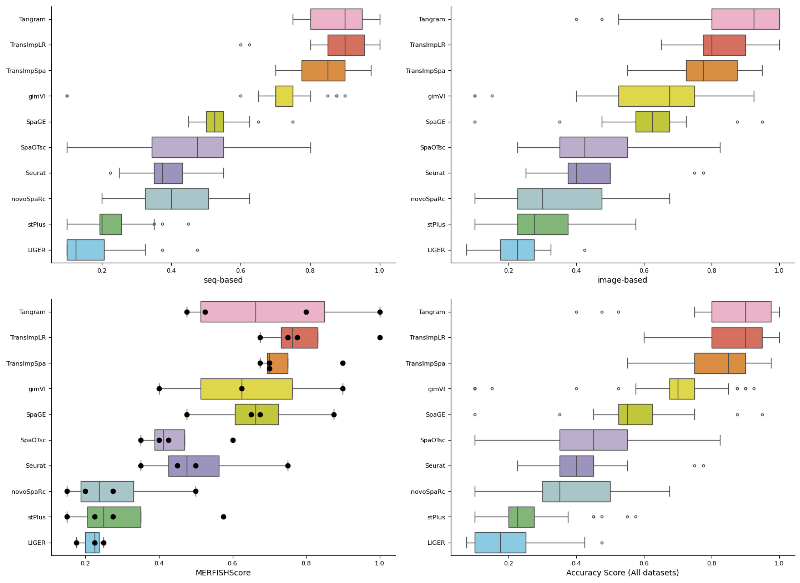

[![PyPi][badge-pypi]][link-pypi]
[![DOC][badge-doc]][link-doc]
[![CI][badge-ci]][link-ci]

[badge-pypi]: https://badge.fury.io/py/transpa.svg
[link-pypi]: https://pypi.org/project/transpa/
[badge-doc]: https://readthedocs.org/projects/transpa/badge/?version=latest
[link-doc]: https://transpa.readthedocs.io/en/latest/
[badge-ci]: https://api.travis-ci.com/qiaochen/tranSpa.svg?branch=main
[link-ci]: https://app.travis-ci.com/github/qiaochen/tranSpa

# Updates on **V0.2.0** :
1. `expDeconv`, improved performance with marker gene selection, loss updates, while keeping lite-weighted and fast, achieving improved performance with default setting on the 32 benchmark datasets by [Li et al.](https://www.nature.com/articles/s41592-022-01480-9).

<div style="text-align: center;">
 
</div>

2. `expVeloImp`, post-processing for imputed Spliced and Unspliced count matrices, the issue reported in Fig. 6 of [VISTA paper](https://www.nature.com/articles/s42003-025-09479-6#Fig6) is now fixed with updated experiment result in notebook [transDeconv.ipynb](https://github.com/qiaochen/tranSpa/blob/main/demo/transDeconv.ipynb). The fix was to sparsify small non-zero values (at 1e-6 magnitude) to zero, since `scv.tl.proportions` cacluate non-zero gene counts to compute proportions, and recalibrate the proportion of spliced/unspliced imputations towards reference distributions.  
3. `expTransImp`, added batch training options to metigate OOM issues raised in [VISTA paper](https://www.nature.com/articles/s42003-025-09479-6#Fig6).
4. `expTransImp`, ran 45 benchmark datasets by [Li et al.](https://www.nature.com/articles/s41592-022-01480-9). The performances of TransImpLR and TransImpSpa are summarized as following:
<div style="text-align: center;">
 
</div>
5. Benchmark memory cost of TransImpLR and TransDeconv (default) on [Li et al.](https://www.nature.com/articles/s41592-022-01480-9).

## TransImpLR — Optimized Memory Usage
| Group | Datasets | Ref Cells | Spots | Genes | Peak RSS (GB) |
|-------|----------|-----------|-------|-------|---------------|
| 0 | D1–D6 | 19K–34K | 175–8,425 | 4,650–31,298 | **19.47** |
| 1 | D7–D12 | 14K–48K | 645–6,963 | 7,239–15,927 | **15.11** |
| 2 | D13–D18 | 8.9K–34K | 982–11,426 | 1,296–14,248 | **10.07** |
| 3 | D19–D23 | 15K–21K | 995–4,895 | 4,815–6,177 | **3.62** |
| 4 | D24–D28 | 16K–27K | 198–2,425 | 1,910–6,177 | **3.67** |
| 5 | D29–D33 | 14K–21K | 1,835–3,794 | 3,511–13,599 | **6.62** |
| 6 | D34–D39 | 12K–25K | 369–9,852 | 3,498–8,345 | **4.49** |
| 7 | D40–D45 | 17K–28K | 603–19,522 | 980–48,163 | **24.04** |
| Summary | |
|---------|--------|
| **Average per group** | **10.89 GB** |
| **Median per group** | **8.35 GB** |
| **Max (group 7, D40–D45)** | **24.04 GB** |
| **Min (group 3, D19–D23)** | **3.62 GB** |
## TransDeconv — Optimized Memory Usage
| Group | Datasets | Ref Cells | Spots | Genes | Peak RSS (GB) |
|-------|----------|-----------|-------|-------|---------------|
| 0 | 1,2,3,4 | 10K/10K/3.8K/6.9K | 1,000 each | 33K/20K/18K/17K | **5.73** |
| 1 | 5,6,7,8 | 10K each | 1,000 each | 21K/19K/18K/18K | **3.28** |
| 2 | 9,10,11,12 | 10K/10K/10K/2.3K | 1,000 each | 21K/16K/18K/16K | **3.29** |
| 3 | 13,14,15,16 | 1K/0.9K/1.4K/6.9K | 1,000 each | 16K/18K/13K/16K | **2.47** |
| 4 | 1r,2r,3r,4r | 10K/10K/10K/8.8K | 1,000 each | 33K/20K/18K/17K | **4.23** |
| 5 | 5r,6r,7r,8r | 10K each | 1,000 each | 21K/19K/18K/18K | **2.60** |
| 6 | 9r,10r,11r,12r | 10K/10K/10K/7.9K | 1,000 each | 21K/16K/18K/16K | **2.49** |
| 7 | 13r,14r,15r,16r | 8.5K/2.3K/1.8K/7.1K | 1,000 each | 16K/18K/13K/16K | **2.50** |
| Summary | |
|---------|--------|
| **Average per group** | **3.32 GB** |
| **Median per group** | **2.94 GB** |
| **Max (group 0, datasets 1–4)** | **5.73 GB** |
| **Min (group 3, datasets 13–16)** | **2.47 GB** |

# TranSpa
This tool implements Translation-based imputation methods (TransImp) and translation based cell type deconvolution (TransDeconv). Experiments reported in the manuscript are displayed in jupyter notebooks under repo [TranSpaAnalysis](https://github.com/qiaochen/TranSpaAnalysis/tree/main), they were run with transpa **V0.1.1**. Report for `TransImp` can be accessed from biorxiv with the latest title 
>[Reliable imputation of spatial transcriptome with uncertainty estimation and spatial regularization](https://www.sciencedirect.com/science/article/pii/S2666389924001545)

Three demo notebooks are also available under the [demo](https://github.com/qiaochen/tranSpa/tree/main/demo) folder.

- [Different configurations of TransImp applied to SeqFISH dataset dataset](https://github.com/qiaochen/tranSpa/blob/main/demo/seqfish.ipynb)
- [Exploration for unprobed genes with SeqFISH ST dataset](https://github.com/qiaochen/tranSpa/blob/main/demo/seqfish_unprobed_genes.ipynb)
- [Cell type deconvolution with TransDeconv and ST Velocity estimation](https://github.com/qiaochen/tranSpa/blob/main/demo/transDeconv.ipynb)
- [Cell type deconvolution with advanced setting](https://github.com/qiaochen/tranSpa/blob/main/demo/transDeconv_advanced.ipynb)

## Installation

TransImp is available through PyPI. To install, type the following command line and add -U for updates:

```
pip install -U transpa (not yet updated to pypi, so please install from the repo)
```

Or, install from the repo:

```
pip install -U git+https://github.com/qiaochen/tranSpa
```

## Data
Data used for running the demo notebooks can be downloaed from [Zenodo](https://zenodo.org/record/8214466)
- [seqfish.ipynb](https://github.com/qiaochen/tranSpa/blob/main/demo/seqfish.ipynb) and [seqfish_unprobed_genes.ipynb](https://github.com/qiaochen/tranSpa/blob/main/demo/seqfish_unprobed_genes.ipynb) requires input data in [seqfish.tar.gz](https://zenodo.org/record/8214151/files/seqfish.tar.gz?download=1)
- [transDeconv.ipynb](https://github.com/qiaochen/tranSpa/blob/main/demo/transDeconv.ipynb) requires input data in [Mouse_brain.tar.gz](https://zenodo.org/record/8214151/files/Mouse_brain.tar.gz?download=1)


## Documentation
Please visit [TransImp website](https://transpa.readthedocs.io/en/latest/) for more details.


